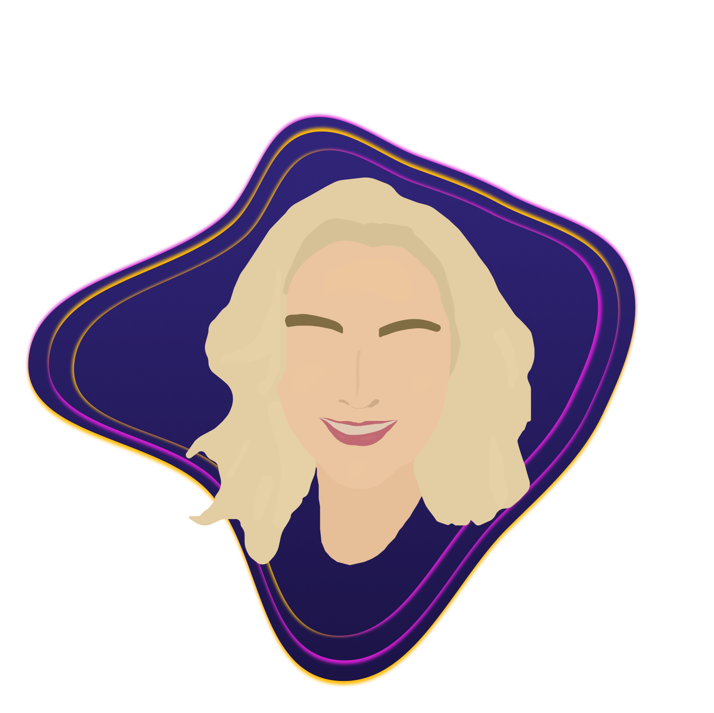

# Oi! Sou a Nurielly (Nury) 👋

Desenvolvedora Full Stack em constante evolução (já são +10 anos!) e apaixonada por criar soluções inovadoras e experiências digitais incríveis.

Adoro testar novas tecnologias e construir projetos divertidos e desafiadores, seja no trabalho ou como hobby.

Sou uma profissional experiente e adaptável, com um histórico de sucesso em diversos projetos. Acredito que a tecnologia pode simplificar a vida das pessoas e me dedico a isso.

- 🌱 Atualmente estou estudando Svelte e desenvolvimento de Jogos para Web
- 👨‍💻 Você pode acessar todos os meu projeto em [www.nury.dev](https://www.nury.dev)
- 💬 Pergunte-me sobre: Codigo, Board games, video games e livros de aventura
- 📫 Para entrar em contato comigo: <a href="mailto:nurycaroline@gmail.com">nurycaroline@gmail.com</a>
- 💼 Atualmente trabalho no Gasola como CTO

## 🛠️ Stack do dia a dia:

	
	
	
	
	
	
	
	
	
	
	

## 🌐 Entre em contato

   
   
   
   
   
   

